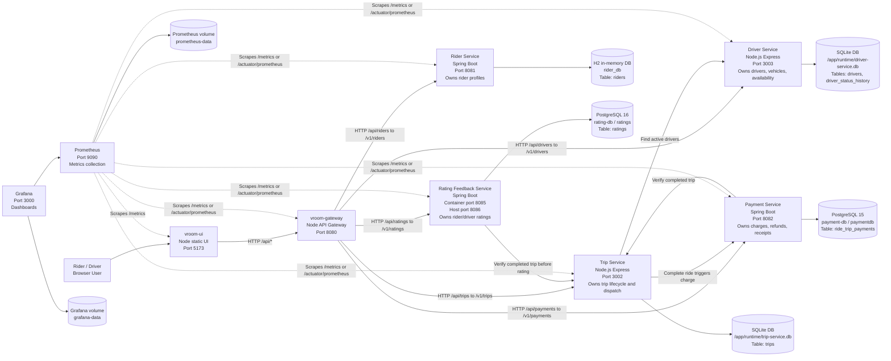

# VROOM VROOM Architecture Diagram

This diagram shows the VROOM VROOM microservices, their HTTP communication, and the database owned by each service.

## Database Ownership

| Component | Database Used | Compose Runtime Location | Main Tables / Data Owned |
|---|---|---|---|
| `rider-service` | H2 in-memory database, `rider_db` | Inside Rider Service process | `riders`: rider id, name, email, phone, city, created timestamp |
| `driver-service` | SQLite | `/app/runtime/driver-service.db`, persisted by `driver-db-data` volume | `drivers`, `driver_status_history`: driver profile, vehicle details, active/offline state history |
| `trip-service` | SQLite | `/app/runtime/trip-service.db`, persisted by `trip-db-data` volume | `trips`: rider id, driver id, trip status, pickup/drop, fare, city, distance, surge, payment status |
| `payment-service` | PostgreSQL 15 | `payment-db` container, database `paymentdb`, persisted by `payment-db-data` volume | `ride_trip_payments`: trip id, amount, method, status, idempotency reference, created timestamp |
| `rating-feedback-service` | PostgreSQL 16 in Docker Compose. Standalone local default can fall back to H2. | `rating-db` container, database `ratings`, persisted by `rating-db-data` volume | `ratings`: trip id, rater, target, score, feedback, unique once-per-rater-trip-target rule |
| `vroom-gateway` | No business database | Not applicable | Routes UI requests to service APIs and propagates calls |
| `vroom-ui` | No business database | Not applicable | Browser UI. Uses browser/local state for panel flow only |
| `prometheus` | Prometheus time-series storage | `prometheus-data` volume | Observability metrics, not business data |
| `grafana` | Grafana internal storage | `grafana-data` volume | Dashboards and datasource configuration, not business data |

## Service Boundary Rule

Each business service owns its own database. Other services do not read another service's database directly. When data is needed across a boundary, the caller uses the owning service's HTTP API.

Examples:

- Trip Service calls Driver Service to find active drivers.
- Trip Service calls Payment Service while completing a paid trip.
- Payment Service calls Trip Service to verify trip completion.
- Rating Feedback Service calls Trip Service before accepting a rating.
- UI calls the Gateway, and the Gateway routes requests to the correct service.
